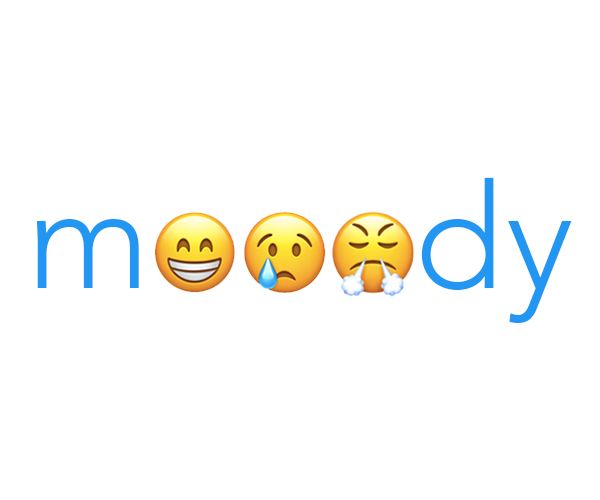

## Princeton University COS 333 Spring 2017 Final Project Website

### Project Name
mooody

### Elevator Pitch
Mental health issues on college campuses have been on the rise for the past decade, and it’s hard to keep up with this increase. When you’re feeling down, you need a place to help make yourself feel better. And, seeing that you are not alone in your hardships is in itself a reassuring feeling. Our project Mooody is a mental health-focused social web app that incorporates three important factors: accessibility, anonymity, and relatability. Mooody provides an online platform for anonymous posting and commenting and also acts as a social mood tracker, where you can input information to track your own mood over time and also see the general mood of people around you. The platform lets users anonymously reach out to other users who have indicated negative feelings on their mood tracker that day, which allows for random acts of kindness and support. Our ultimate goal is to provide a supportive community to college campuses.

### Group Members
Lindy Zeng (lindy@princeton.edu)

Jesse Chou (jc45@princeton.edu)

Xiao Yang Yu (xyyu@princeton.edu)

Katelyn Neese (kneese@princeton.edu)

### Project Leader
Xiao Yang Yu

### Project Manager
Nick Giannarakis (ng8@princeton.edu) 

### Design Document
[Link](XiaoYang_Yu.pdf)

### Milestones
- [x] Sun. March 19: Design Document due
- [x] Mon. March 27: 
  - Project status website online
  -	Basic server template coded, server running locally
  -	Very simple user system implemented (no banning/points system yet, no phone/email verification system yet)
- [X] Mon. April 3:
  -	Basic functionality on server, running locally: ability to write posts, upvote/downvote posts, expand posts, comment on posts, upvote/downvote comments (on each of the different tabs)
  -	Social mood and personal mood tracking features implemented (just the basics for now, will add more if time allows)
  -	Front-end will be minimalistic, more important to get server-side stuff working first
 - [X] Mon. April 10: 
    -	Complete user system
    -	Polish front-end
    -	Make sure all code so far is tested on real users so that we have a functional prototype
- [X]	Fri. April 14: Project Prototype
- [X] Mon. April 17:
  -	Implement private messaging system for supportive messaging
- [ ] Mon. April 24:
  -	Host on Heroku server in preparation for alpha test
  -	Continue testing with real users
- [ ]	Fri. April 28: Alpha Test
- [ ] Mon. May 1:
  -	Refine interface and functionality based on feedback from alpha tests and external users
  -	Extra time to deal with overhead (documentation) and unexpected turns of events
  -	If more time: additional features (but that would require even more testing, so doubtful at this point)
- [ ]	Thu. May 4 - Fri. May 5: Beta Test
- [ ]	Mon. May 8 - Wed. May 10: Demo Days
- [ ] Sun. May 14: Final Project due

### Demo Slides
[TBD]
